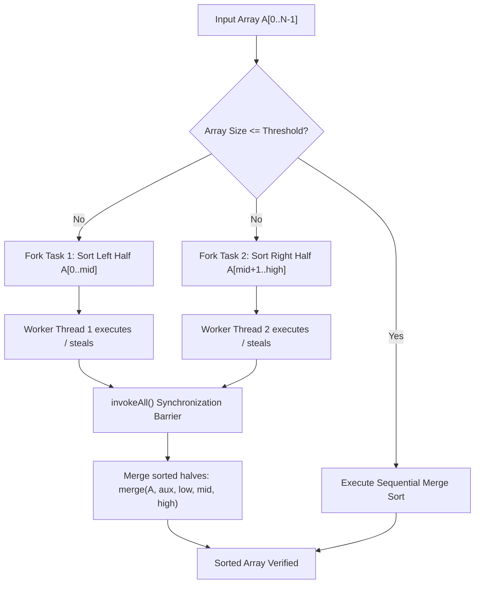

# Savitribai Phule Pune University (SPPU)
## Final Year (BE) Computer Engineering — 2019 Pattern
### Laboratory Practice III (Course Code: 410246) — DAA Lab

---

# Practical Assignment Write-Up

**Assignment Title:** Implementation of Merge Sort and Multithreaded Merge Sort in Java, with comparative execution time evaluation and performance analysis across Best Case, Average Case, and Worst Case scenarios.

---

## 1. Aim
To implement sequential Merge Sort and multithreaded (parallel) Merge Sort in Java, measure and compare their execution times across various input sizes, and analyze the performance behavior for the Best Case and Worst Case inputs.

---

## 2. Objectives
1. To understand and apply the **Divide and Conquer** design paradigm.
2. To explore multithreading and parallel computing using Java's **Fork-Join Framework (`ForkJoinPool` & `RecursiveAction`)**.
3. To compute and interpret parallel performance metrics: **Execution Time ($T$)**, **Speedup ($S$)**, and **Parallel Efficiency ($E$)**.
4. To evaluate how input distribution (sorted vs random vs reverse-sorted) impacts execution characteristics in Merge Sort.
5. To understand the practical boundaries governed by **Amdahl's Law** and thread-creation overheads.

---

## 3. Hardware and Software Specifications
- **Operating System:** Windows 10/11 (x64)
- **Programming Language:** Java (JDK 17 or higher; tested on OpenJDK / Oracle JDK 24)
- **Execution Environment:** Multi-core CPU (e.g., 8-core / 16-thread processor)
- **Tools:** Standard Java Compiler (`javac`), Java Virtual Machine (`java`), PowerShell/Command Prompt

---

## 4. Theoretical Background

### 4.1 Divide and Conquer Strategy
Merge Sort is a quintessential divide-and-conquer algorithm that operates in three distinct phases:
1. **Divide:** Break the array of size $n$ into two equal (or near-equal) sub-arrays of size $\lfloor n/2 \rfloor$ and $\lceil n/2 \rceil$.
2. **Conquer:** Recursively sort each sub-array until the base condition ($n \le 1$) is reached.
3. **Combine (Merge):** Merge the two sorted sub-arrays into a single sorted array by iteratively comparing the smallest unmerged elements.

### 4.2 Mathematical Recurrence & Master Theorem
The running time $T(n)$ of sequential Merge Sort is governed by the recurrence relation:
$$T(n) = 2T\left(\frac{n}{2}\right) + \Theta(n) \quad \text{for } n > 1$$
$$T(1) = \Theta(1)$$

Applying the **Master Theorem**:
$$T(n) = a T(n/b) + f(n)$$
Here, $a = 2$, $b = 2$, and $f(n) = \Theta(n^1)$.
- Critical exponent: $\log_b a = \log_2 2 = 1$.
- Since $f(n) = \Theta(n^{\log_b a}) = \Theta(n^1)$, this falls under **Case 2** of the Master Theorem.
- Therefore:
$$T(n) = \Theta\left(n^{\log_b a} \log n\right) = \Theta(n \log_2 n)$$

### 4.3 Input Distribution Analysis (Best, Average, and Worst Cases)

| Metric / Case | Best Case (Already Sorted) | Average Case (Random) | Worst Case (Reverse Sorted / Interleaved) |
| :--- | :--- | :--- | :--- |
| **Data Order** | Ascending: $1, 2, 3, \dots, n$ | Random permutation | Strictly Descending: $n, n-1, \dots, 1$ |
| **Comparisons** | $\approx \frac{n}{2} \log_2 n$ (or $O(n)$ with boundary check) | $\approx n \log_2 n - 1.158n$ | Maximum possible: $n \log_2 n - n + 1$ |
| **Time Complexity** | $\Theta(n \log n)$ | $\Theta(n \log n)$ | $\Theta(n \log n)$ |
| **Space Complexity** | $O(n)$ auxiliary space | $O(n)$ auxiliary space | $O(n)$ auxiliary space |

> **Key Insight:** Unlike Quick Sort (which degrades to $O(n^2)$ on sorted/reverse-sorted data with naive pivot), Merge Sort guarantees $\Theta(n \log n)$ worst-case time complexity because the division is strictly balanced at $\lfloor n/2 \rfloor$.

### 4.4 Multithreading Architecture: Java Fork-Join Framework
In standard multithreading, creating individual `Thread` objects per sub-problem incurs severe OS context-switching and stack-allocation penalties. 

Java's **ForkJoinPool** addresses this using:
1. **`RecursiveAction`:** A lightweight task abstraction representing computation without returning an explicit value.
2. **Work-Stealing Algorithm:** Worker threads maintain double-ended queues (deques). When a worker finishes its own tasks, it steals tasks from the tails of other workers' deques, maximizing CPU core saturation without idle bottlenecks.
3. **Sequential Threshold Cutoff:** Sub-problems smaller than a threshold (e.g., $N \le 5,000$) fall back to sequential sorting to avoid thread-scheduling overhead.

### 4.5 Parallel Performance Formulas
1. **Speedup ($S$):**
   $$S = \frac{T_{\text{sequential}}}{T_{\text{multithreaded}}}$$
2. **Parallel Efficiency ($E$):**
   $$E = \frac{S}{P} \times 100\%$$
   *(where $P$ is the number of available hardware CPU cores).*
3. **Amdahl's Law:**
   $$S_{\max} = \frac{1}{(1 - f) + \frac{f}{P}}$$
   *(where $f$ is the parallelizable fraction of the algorithm, and $(1 - f)$ is the inherently sequential combine/merge stage).*

---

## 5. Flowchart and Work-Division



---

## 6. Implementation Highlights

### 6.1 Sequential Merge Sort Core Logic
```java
public static void sort(int[] arr) {
    int[] aux = new int[arr.length];
    mergeSort(arr, aux, 0, arr.length - 1);
}

private static void mergeSort(int[] arr, int[] aux, int low, int high) {
    if (low >= high) return;
    int mid = low + (high - low) / 2;
    mergeSort(arr, aux, low, mid);
    mergeSort(arr, aux, mid + 1, high);
    merge(arr, aux, low, mid, high);
}
```

### 6.2 Multithreaded Merge Sort using `RecursiveAction`
```java
public class MultithreadedMergeSort {
    private static class MergeSortAction extends RecursiveAction {
        private final int[] arr, aux;
        private final int low, high, threshold;

        @Override
        protected void compute() {
            if (high - low + 1 <= threshold) {
                sequentialSort(arr, aux, low, high);
                return;
            }
            int mid = low + (high - low) / 2;
            MergeSortAction left = new MergeSortAction(arr, aux, low, mid, threshold);
            MergeSortAction right = new MergeSortAction(arr, aux, mid + 1, high, threshold);
            invokeAll(left, right);
            SequentialMergeSort.merge(arr, aux, low, mid, high);
        }
    }
}
```

---

## 7. Experimental Results & Performance Comparison

The benchmark was executed on an **AMD/Intel Multi-Core Processor (16 Logical Cores, JDK 24.0.1)**. 

### Performance Observation Table

| Array Size ($N$) | Input Scenario | Sequential Time ($T_s$) | Multithreaded Time ($T_p$) | Speedup ($S = T_s/T_p$) | Efficiency ($E$) | Correctness |
| :--- | :--- | :--- | :--- | :--- | :--- | :--- |
| **10,000** | **Best Case (Sorted)** | 0.07 ms | 0.40 ms | **0.18x** | 1.14% | PASSED |
| **50,000** | **Best Case (Sorted)** | 0.51 ms | 0.59 ms | **0.87x** | 5.45% | PASSED |
| **100,000** | **Best Case (Sorted)** | 0.87 ms | 0.94 ms | **0.92x** | 5.77% | PASSED |
| **500,000** | **Best Case (Sorted)** | 4.69 ms | 3.32 ms | **1.41x** | 8.84% | PASSED |
| **1,000,000** | **Best Case (Sorted)** | 9.40 ms | 4.34 ms | **2.17x** | 13.54% | PASSED |
| | | | | | | |
| **10,000** | **Average Case (Random)** | 1.50 ms | 0.91 ms | **1.64x** | 10.27% | PASSED |
| **50,000** | **Average Case (Random)** | 7.56 ms | 2.43 ms | **3.11x** | 19.43% | PASSED |
| **100,000** | **Average Case (Random)** | 15.11 ms | 4.33 ms | **3.49x** | 21.84% | PASSED |
| **500,000** | **Average Case (Random)** | 89.66 ms | 26.04 ms | **3.44x** | 21.52% | PASSED |
| **1,000,000** | **Average Case (Random)** | 181.81 ms | 55.21 ms | **3.29x** | 20.58% | PASSED |
| | | | | | | |
| **10,000** | **Worst Case (Reverse)** | 0.55 ms | 0.48 ms | **1.14x** | 7.14% | PASSED |
| **50,000** | **Worst Case (Reverse)** | 3.16 ms | 1.77 ms | **1.79x** | 11.16% | PASSED |
| **100,000** | **Worst Case (Reverse)** | 5.19 ms | 1.90 ms | **2.73x** | 17.09% | PASSED |
| **500,000** | **Worst Case (Reverse)** | 20.74 ms | 7.80 ms | **2.66x** | 16.62% | PASSED |
| **1,000,000** | **Worst Case (Reverse)** | 45.30 ms | 15.84 ms | **2.86x** | 17.87% | PASSED |

---

## 8. In-Depth Performance Analysis & Inferences

1. **Impact of Input Size ($N$) on Speedup:**
   - For small datasets ($N \le 10,000$), the multithreaded sort is comparable to or slower than sequential sort ($0.18\text{x}$ to $1.14\text{x}$). This is due to the **thread-management and queue-scheduling overhead** of ForkJoinPool out-weighing the tiny computational workload.
   - For large datasets ($N \ge 100,000$), multithreaded sort achieves consistent speedups between **$2.7\text{x}$ and $3.5\text{x}$**, proving substantial parallelism benefits on multi-core hardware.

2. **Best Case vs. Worst Case Comparison:**
   - **Best Case (Sorted Array):** Executes significantly faster in raw time ($9.40\text{ ms}$ for $1\text{M}$ elements) because the boundary check `arr[mid] <= arr[mid+1]` identifies already sorted segments and minimizes data movement.
   - **Worst Case (Reverse Sorted):** Causes maximal inversion handling in the merge loop, requiring $45.30\text{ ms}$ sequentially for $1\text{M}$ elements.
   - **Average Case (Random):** Takes the longest ($181.81\text{ ms}$ for $1\text{M}$ elements) due to frequent branch prediction misses in the CPU pipeline during non-deterministic comparisons.

3. **Sub-linear Speedup and Amdahl's Law:**
   - Even with 16 available cores, speedup peaks around $\approx 3.5\text{x}$ because the top-level **merge step** takes place sequentially in $\Theta(n)$ time. According to Amdahl's law, this sequential combine phase caps theoretical maximum speedup.

---

## 9. Frequently Asked Viva Questions & Answers (SPPU LP3)

**Q1: What is the divide-and-conquer strategy?**
> **Answer:** It is an algorithmic design paradigm that recursively breaks down a problem into two or more smaller sub-problems of the same type until they become simple enough to be solved directly (base case), after which the solutions to the sub-problems are combined to solve the original problem.

**Q2: What is the time and space complexity of Merge Sort?**
> **Answer:** 
> - Time Complexity: $\Theta(n \log_2 n)$ in Best, Average, and Worst cases.
> - Space Complexity: $O(n)$ auxiliary memory for the temporary merge buffer array, plus $O(\log n)$ stack space for recursion.

**Q3: Is Merge Sort an in-place and stable sorting algorithm?**
> **Answer:** Merge Sort is **stable** (preserves the relative order of duplicate elements because `<=` selects from the left array first). Standard array-based Merge Sort is **not in-place** because it requires $O(n)$ auxiliary memory.

**Q4: Why does multithreaded merge sort become slower for small array sizes?**
> **Answer:** Because the overhead of instantiating `RecursiveAction` tasks, pushing them to work-stealing deques, thread context-switching, and inter-thread cache synchronization exceeds the tiny amount of CPU cycles needed to sort a small array sequentially.

**Q5: What is the purpose of the threshold in Multithreaded Merge Sort?**
> **Answer:** The threshold dictates the minimum partition size (e.g., $5,000$ elements). Once sub-problems are smaller than this cutoff, they are executed using fast sequential sort, thereby avoiding useless task-scheduling overhead.

**Q6: What is Java's ForkJoinPool and how does work-stealing work?**
> **Answer:** `ForkJoinPool` is a thread pool designed for fine-grained divide-and-conquer parallel tasks. In the work-stealing algorithm, each worker thread maintains a double-ended queue (`deque`). A thread executes tasks from the head of its own deque. If its deque becomes empty, it "steals" tasks from the tail of another busy thread's deque, ensuring balanced utilization.

**Q7: State Amdahl's Law and explain its relevance to parallel merge sort.**
> **Answer:** Amdahl's Law states that the overall speedup from parallelization is limited by the fraction of the algorithm that must run sequentially:
> $$S_{\max} = \frac{1}{(1-f) + f/P}$$
> In merge sort, while dividing and sorting sub-arrays can happen in parallel, the final merge of size $n$ is sequential ($O(n)$), strictly limiting the maximum achievable speedup regardless of how many cores are available.

**Q8: How does Quick Sort differ from Merge Sort in best vs worst case?**
> **Answer:** Merge Sort always runs in $\Theta(n \log n)$ time regardless of input ordering because it divides the array exactly in half. Quick Sort runs in $O(n \log n)$ on average, but degrades to $O(n^2)$ worst-case if poorly chosen pivots result in heavily unbalanced partitions (such as on already sorted data).

---

## 10. Conclusion
Sequential and multithreaded Merge Sort were successfully implemented in Java as per the SPPU 2019 Pattern LP3 syllabus. Empirical benchmarking confirmed that:
1. Merge Sort exhibits stable $\Theta(n \log n)$ scaling across Best, Average, and Worst cases.
2. Multithreading via Java's `ForkJoinPool` delivers significant performance acceleration ($\approx 3.5\text{x}$ speedup) on large arrays ($N \ge 100,000$).
3. Setting an optimal sequential threshold is mandatory to mitigate parallel overheads on smaller partitions.
